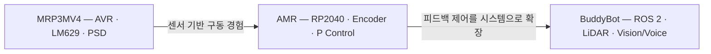
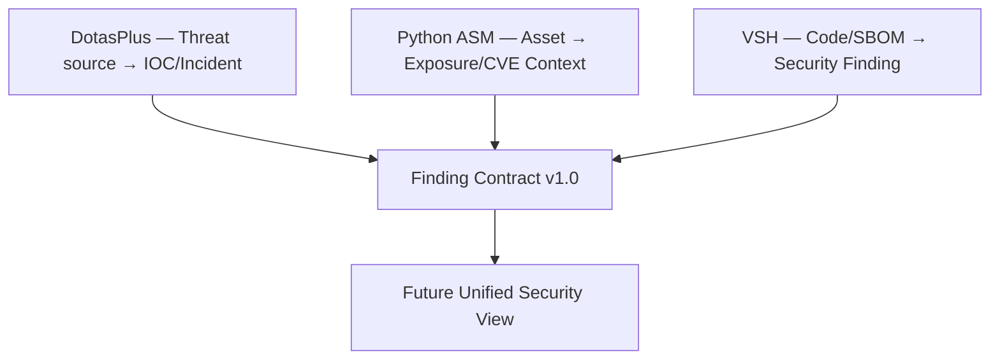

# 김민건 | rasasoe

Software Engineering Student · Security · Embedded/Robotics

보안 분석 도구와 실제 로봇 시스템을 만들며, **탐지 결과가 어떻게 생성되고 시스템의 실제 동작으로 어떻게 이어지는지**를 구현하고 검증합니다.

## Focus

- **Security Engineering** — Application Security, Attack Surface Management, Threat Intelligence
- **Robotics & Embedded Systems** — ROS 2, Raspberry Pi, RP2040, sensor integration, feedback control
- **System Integration** — Python services, Linux, APIs, observability, fail-safe control paths

## Featured Projects

| Project | What it demonstrates | Status |
| --- | --- | --- |
| [BuddyBot](https://github.com/rasasoe/BuddyBot) | Pi 5–Pico 책임 분리, ROS 2 자율주행, LiDAR 회피, 사용자 추종, 음성·웹 제어를 통합한 실물 로봇 | **Robotics flagship** |
| [VSH](https://github.com/rasasoe/VSH) | Semgrep·SBOM·reasoning·검증 결과를 Electron UI로 연결한 데스크톱 중심 AppSec 플랫폼 | **Security flagship** |
| [python-asm-framework](https://github.com/rasasoe/python-asm-framework) | 허가된 자산의 포트·서비스·OpenAPI·UI 노출을 수집하고 CVE 지식과 위험 점수로 연결 | Attack Surface tool |
| [DotasPlus](https://github.com/rasasoe/DotasPlus) | 외부 위협 문서에서 IOC를 추출하고 조직 자산과 연결해 Incident로 만드는 CTI 파이프라인 | Threat Intelligence MVP |

## Robotics Development Path

- [MRP3MV4](https://github.com/rasasoe/MRP3MV4) — 보드 중심의 홀로노믹 구동과 센서 데모
- [AMR](https://github.com/rasasoe/AMR) — Pico·엔코더·P제어·역기구학 직접 구현
- [BuddyBot](https://github.com/rasasoe/BuddyBot) — ROS 2 상위 인지·계획과 Pico 실시간 모터·안전 제어 통합

> 세 프로젝트는 같은 코드를 버전업한 관계가 아니라, 앞 단계에서 검증한 제어 원리와 통합 경험을 다음 설계로 확장한 개발 과정입니다.

## Security Project Map

| Project | Security view | Current position |
| --- | --- | --- |
| [DotasPlus](https://github.com/rasasoe/DotasPlus) | 외부 위협 소스, IOC, 조직 자산 연관 분석 | CTI MVP · normalized persistence + CI |
| [python-asm-framework](https://github.com/rasasoe/python-asm-framework) | 외부 노출 자산, 서비스, API 구조와 CVE 지식 매핑 | Focused ASM · normalized export + tests |
| [VSH](https://github.com/rasasoe/VSH) | 소스코드·의존성·SBOM 기반 애플리케이션 보안 검증 | AppSec flagship · Finding export + CI |

세 프로젝트는 탐지 대상이 다르므로 하나의 거대한 저장소로 합치지 않습니다. 각 프로젝트가 현재 `schema_version: "1.0"` 공통 Finding JSON을 독립적으로 내보내며, 다음 단계에서는 별도 통합 뷰가 세 결과를 소비하도록 확장합니다.

## Tech

`Python` · `FastAPI` · `Linux` · `Docker` · `ROS 2` · `RP2040` · `OpenCV` · `Semgrep` · `React` · `Electron`

## Links

- [Security Blog — Devin's Security Lab](https://rasasoe.tistory.com)
- [BuddyBot Portfolio](https://github.com/rasasoe/BuddyBot)
