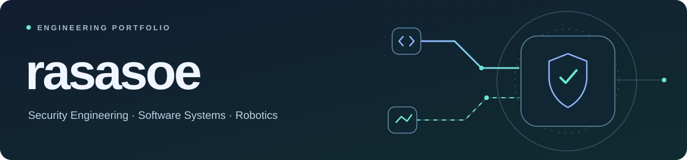
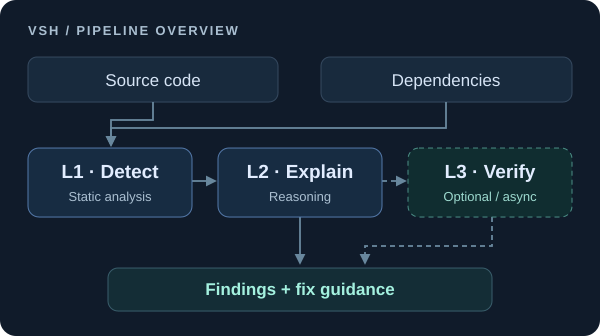
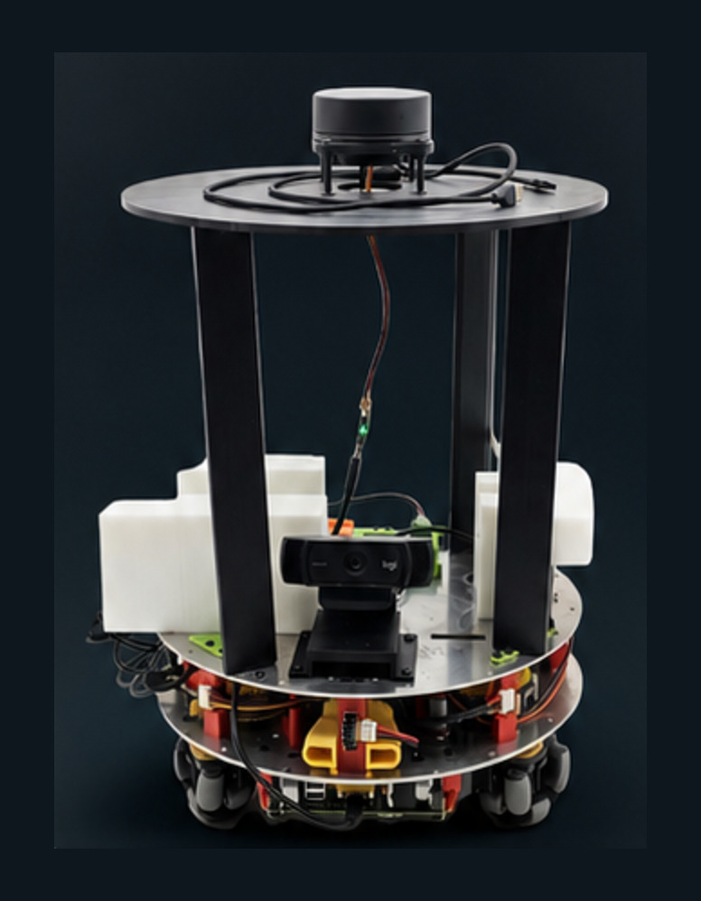

<picture>
  <source media="(max-width: 600px)" srcset="assets/profile-banner-mobile.svg">
  
</picture>

# 김민건

**Security Engineering · Software Systems · Robotics** 
보안 분석 도구를 개발하고, 실물 로봇으로 시스템 설계·통합 역량을 검증하는 소프트웨어 전공 학생입니다. 
**탐지의 근거를 설명하고, 설계가 실제 동작으로 이어지는 시스템을 구현합니다.**

**[기술 블로그 ↗](https://rasasoe.tistory.com)** &nbsp; · &nbsp; [보안 프로젝트](#보안-프로젝트) &nbsp; · &nbsp; [로봇 개발 과정](#로봇-개발-과정)

## 대표 프로젝트

<table>
  <tr>
    <td width="50%" valign="top">
      <h3><a href="https://github.com/rasasoe/VSH">VSH ↗</a></h3>
      
<b>코드 위험을 설명하는 AppSec 도구</b>

      
<a href="https://github.com/rasasoe/VSH"><picture><source media="(max-width: 600px)" srcset="assets/vsh-workflow-mobile.svg"></picture></a>

      
정적 분석·의존성 점검·추론 결과를 데스크톱 UI로 연결하는 AppSec 프로젝트입니다. 원본 기반 fork에서 분석 연동과 공통 결과 export를 확장했습니다.

      
<code>Python</code> <code>FastAPI</code> <code>Electron</code>

      
<a href="https://github.com/rasasoe/VSH#my-contributions">기여·커밋</a> · <a href="https://github.com/rasasoe/VSH#실행-화면">실행 화면</a> · <a href="https://github.com/rasasoe/VSH#검증과-한계">검증·한계</a>

    </td>
    <td width="50%" valign="top">
      <h3><a href="https://github.com/rasasoe/BuddyBot">BuddyBot ↗</a></h3>
      
<b>ROS 2 기반 실내 자율주행 로봇</b>

      

      
인지·계획과 모터 제어를 분리하고, 자율이동·추종·음성 제어를 통합했습니다.

      
<code>ROS 2</code> <code>RP2040</code> <code>OpenCV</code>

      
<a href="https://github.com/rasasoe/BuddyBot#동작-데모">주행·추종 영상</a> · <a href="https://github.com/rasasoe/BuddyBot#전체-아키텍처">아키텍처</a>

    </td>
  </tr>
</table>

BuddyBot에서는 **팀장 · 전체 아키텍처 설계 · 시스템 통합**을 담당했습니다.

## 보안 프로젝트

- **[VSH · 애플리케이션 보안](https://github.com/rasasoe/VSH)** — 소스코드·의존성의 위험과 수정 방향을 보여줍니다.
- **[Python ASM · 공격 표면 분석](https://github.com/rasasoe/python-asm-framework)** — 허가된 자산의 포트·서비스·API 노출을 점검합니다.
- **[DotasPlus · 위협 인텔리전스](https://github.com/rasasoe/DotasPlus)** — 외부 문서에서 IOC를 추출하고 조직 자산과 연결합니다.

세 도구는 **Finding v1.0 공통 JSON**으로 결과를 내보냅니다. 결과를 한 화면으로 모으는 통합 뷰는 다음 개발 단계입니다.

## 로봇 개발 과정

**[MRP3MV4](https://github.com/rasasoe/MRP3MV4) → [AMR](https://github.com/rasasoe/AMR) → [BuddyBot](https://github.com/rasasoe/BuddyBot)**

구동·센서 실험에서 직접 구현한 피드백 제어를 거쳐, ROS 2 기반 시스템 통합으로 발전시켰습니다.

각 단계에서 해결한 문제와 기술 보기

| 단계 | 핵심 경험 |
| --- | --- |
| MRP3MV4 | AVR·LM629 기반 홀로노믹 구동과 PSD·카메라 데모 |
| AMR | Pico·엔코더·P제어·역기구학으로 바퀴별 속도 제어 |
| BuddyBot | Pi 5–Pico 책임 분리, ROS 2 인지·계획, command mux·watchdog 통합 |

같은 코드를 그대로 버전업한 관계가 아니라, 앞 단계의 제어 원리와 통합 경험을 다음 설계로 확장한 과정입니다.

주요 기술: <code>Python</code> · <code>Linux</code> · <code>Docker</code> · <code>FastAPI</code> · <code>ROS 2</code> · <code>RP2040</code> · <code>OpenCV</code> · <code>Semgrep</code> · <code>React</code> · <code>Electron</code>

---

**[Devin's Security Lab ↗](https://rasasoe.tistory.com)** · 기술 블로그
